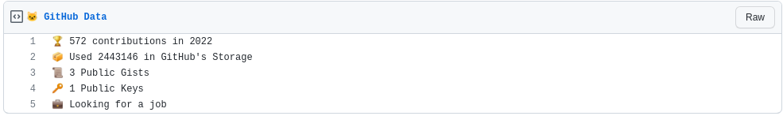

  
  <h3 align="center">gh-box</h3>
  
Update a pinned gist to contain your GitHub profile data

## Setup

### Prep work

1. Create a new public GitHub Gist (https://gist.github.com/)
1. Create a token with the `user`, `admin:public_key` and `gist` scope and copy it. (https://github.com/settings/tokens/new)

### Project setup

1. Fork this repo
1. Go to the repo **Settings > Secrets**
1. Add the following environment variables:
   - **GH_TOKEN:** The GitHub token generated above.
   - **GIST_ID:** The ID portion from your gist url: `https://gist.github.com/yg/`**`be81d4ed35437d17f164c672d8d2960c`**.
   - **CONSIDER_PRIVATE:** Boolean value, If true it will count private repos too.

## License

MIT © [Gulshan Yadav](LICENSE)
